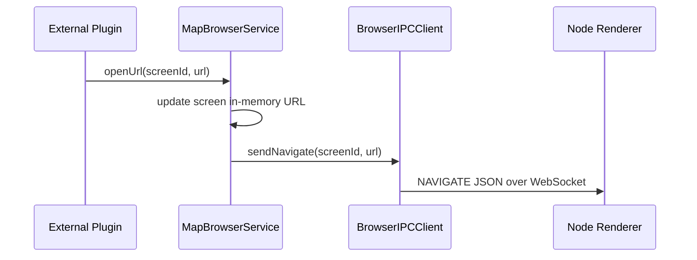

# MapBrowser Public API (Draft)

This document describes the current plugin-facing API boundary for integrations.

## API Flow



## Entry Point

Use the plugin instance and service accessor:

```java
MapBrowserPlugin plugin = MapBrowserPlugin.getInstance();
MapBrowserService service = plugin.getService();
```

## Service Interface

Current methods are defined in [src/main/java/com/tukuyomil032/mapbrowser/service/MapBrowserService.java](../src/main/java/com/tukuyomil032/mapbrowser/service/MapBrowserService.java):

- `Collection<Screen> getAllScreens()`
- `Optional<Screen> getScreen(UUID screenId)`
- `void openUrl(UUID screenId, String url)`
- `boolean reload(UUID screenId)`
- `boolean setFps(UUID screenId, int fps)`
- `boolean close(UUID screenId)`
- `boolean goBack(UUID screenId)`
- `boolean goForward(UUID screenId)`
- `ServiceStatus status()`

| Method | Input | Output | Behavior |
|---|---|---|---|
| getAllScreens | - | Collection<Screen> | Returns current runtime screen list |
| getScreen | UUID | Optional<Screen> | Returns screen if found |
| openUrl | UUID, String | void | Updates URL and emits NAVIGATE IPC |
| reload | UUID | boolean | Emits RELOAD IPC if screen exists |
| setFps | UUID, int | boolean | Updates runtime FPS and emits SET_FPS IPC |
| close | UUID | boolean | Emits CLOSE IPC if screen exists |
| goBack | UUID | boolean | Emits GO_BACK IPC if screen exists |
| goForward | UUID | boolean | Emits GO_FORWARD IPC if screen exists |
| status | - | ServiceStatus | Returns IPC/screen summary |

## Notes

- `openUrl(...)` sends a navigate request to browser-renderer and updates in-memory URL state.
- URL validation should be handled by caller or routed through command/security flow when needed.
- `status()` currently exposes `ipcConnected` and `screenCount`.
- API is intentionally minimal and may evolve before stable release.

## Integration Guidance

- Avoid direct manager access from external plugins; prefer `MapBrowserService`.
- Treat `Screen` as a runtime model; persistence format may change.
- For cross-server/proxy scenarios, use the velocity messaging bridge channel `mapbrowser:velocity`.

## Usage Examples

### Java plugin integration example

```java
MapBrowserPlugin plugin = MapBrowserPlugin.getInstance();
MapBrowserService service = plugin.getService();

UUID screenId = UUID.fromString("00000000-0000-0000-0000-000000000001");

service.openUrl(screenId, "https://example.com");
service.setFps(screenId, 15);
service.reload(screenId);
service.goBack(screenId);

MapBrowserService.ServiceStatus status = service.status();
plugin.getLogger().info("ipcConnected=" + status.ipcConnected()
	+ ", screens=" + status.screenCount());
```

### Velocity plugin message payload example

```java
ByteArrayOutputStream bos = new ByteArrayOutputStream();
DataOutputStream out = new DataOutputStream(bos);
out.writeUTF("SET_FPS");
out.writeUTF(screenId.toString());
out.writeInt(20);
out.flush();

player.sendPluginMessage(plugin, "mapbrowser:velocity", bos.toByteArray());
```

### Companion Mod context

- The backend plugin can forward `AUDIO_FRAME` payloads over plugin messaging.
- Minecraft vanilla clients cannot decode these payloads as in-game audio.
- A companion client-side mod is required to decode and play those packets spatially.
- This repository currently provides the server-side transport and diagnostics path; client-side playback implementation and compatibility validation must be done with the companion mod side.

## Velocity Bridge Commands (Current)

- `PING`:
	- Request status snapshot from backend server.
	- Response command is `STATUS` with fields: `screenCount`, `ipcConnected`, `onlinePlayers`.
- `OPEN_URL`:
	- Payload: `screenId` (UUID), `url`.
	- Backend validates URL with the same security rules as player command flow.
- `RELOAD_SCREEN`:
	- Payload: `screenId` (UUID).
	- Backend invokes service `reload(...)`.
- `SET_FPS`:
	- Payload: `screenId` (UUID), `fps` (int).
	- Backend validates fps range and invokes service `setFps(...)`.
- `CLOSE_SCREEN`:
	- Payload: `screenId` (UUID).
	- Backend invokes service `close(...)`.
- `BACK_SCREEN`:
	- Payload: `screenId` (UUID).
	- Backend invokes service `goBack(...)`.
- `FORWARD_SCREEN`:
	- Payload: `screenId` (UUID).
	- Backend invokes service `goForward(...)`.

| Command | Direction | Payload | Result |
|---|---|---|---|
| PING | Proxy -> Backend | - | STATUS response |
| STATUS | Backend -> Proxy | screenCount, ipcConnected, onlinePlayers | Current backend snapshot |
| OPEN_URL | Proxy -> Backend | screenId, url | URL validated then NAVIGATE applied |
| RELOAD_SCREEN | Proxy -> Backend | screenId | RELOAD applied when screen exists |
| SET_FPS | Proxy -> Backend | screenId, fps | FPS updated and SET_FPS applied |
| CLOSE_SCREEN | Proxy -> Backend | screenId | CLOSE applied when screen exists |
| BACK_SCREEN | Proxy -> Backend | screenId | GO_BACK applied when screen exists |
| FORWARD_SCREEN | Proxy -> Backend | screenId | GO_FORWARD applied when screen exists |
