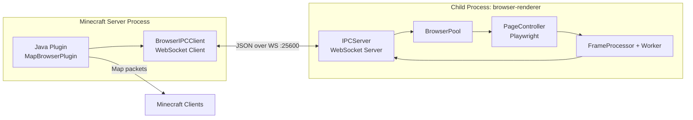
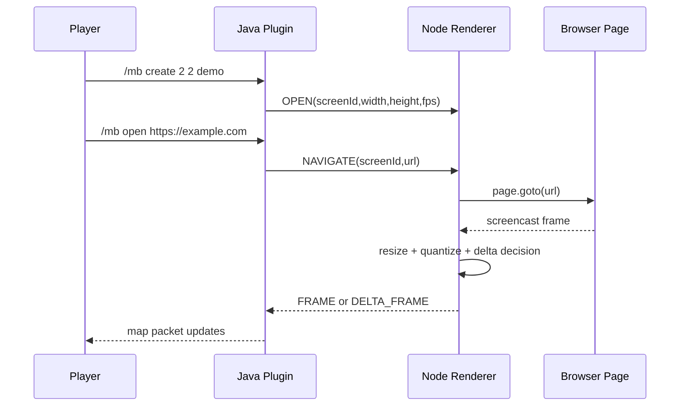
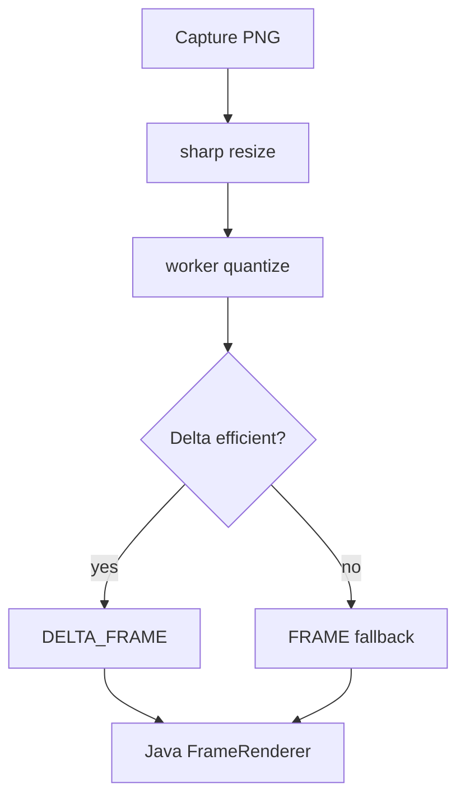

# Architecture (en-us)

## High-Level Topology

## Component Matrix

| Side | Component | Responsibility |
|---|---|---|
| Java | ScreenManager | Screen lifecycle and selection state |
| Java | FrameRenderer | Apply FRAME/DELTA_FRAME to map buffers |
| Java | BrowserIPCClient | Process launch, WS connection, IPC routing |
| Java | InputHandler | Player interaction to browser control conversion |
| Java | DataStore | YAML/SQLite persistence |
| Node | IPCServer | Java message routing and event emission |
| Node | BrowserPool | screenId to page controller mapping |
| Node | PageController | Playwright page actions and screencast capture |
| Node | FrameProcessor | Resize, quantize, delta/full-frame decision |
| Node | quantize.worker | Palette quantization in worker thread |

## Communication Workflow

## IPC Message Families

| Direction | Message types | Purpose |
|---|---|---|
| Java -> Node | OPEN, NAVIGATE, MOUSE_CLICK, SCROLL, GO_BACK, GO_FORWARD, RELOAD, CLOSE, SET_FPS | Control browser and screen lifecycle |
| Node -> Java | READY, FRAME, DELTA_FRAME, URL_CHANGED, PAGE_LOADED, AUDIO_FRAME, ERROR | Render/output events and status |

## Frame pipeline

1. Playwright captures frame
2. sharp resizes to map resolution
3. worker quantizes to map palette indexes
4. delta rectangle is computed
5. if delta is too large, full frame fallback is used
6. FRAME or DELTA_FRAME is sent to Java side

## Data persistence

| Backend | Use case | Notes |
|---|---|---|
| yaml | Simple local setup | Easy to inspect manually |
| sqlite | Production-like operation | Better scalability and consistency |

## Bridges

| Bridge | Channel | Current commands |
|---|---|---|
| Audio | mapbrowser:audio | encoded frame forwarding |
| Velocity | mapbrowser:velocity | PING/STATUS, OPEN_URL, RELOAD_SCREEN, SET_FPS, CLOSE_SCREEN, BACK_SCREEN, FORWARD_SCREEN |

Velocity `STATUS` currently returns:

- screenCount
- ipcConnected
- onlinePlayers
- ipcHealthSummary
- inboundTotal
- inboundFrame
- inboundDelta
- audioDiagnostics
