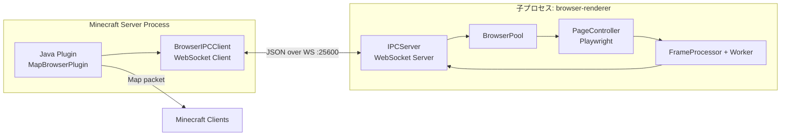
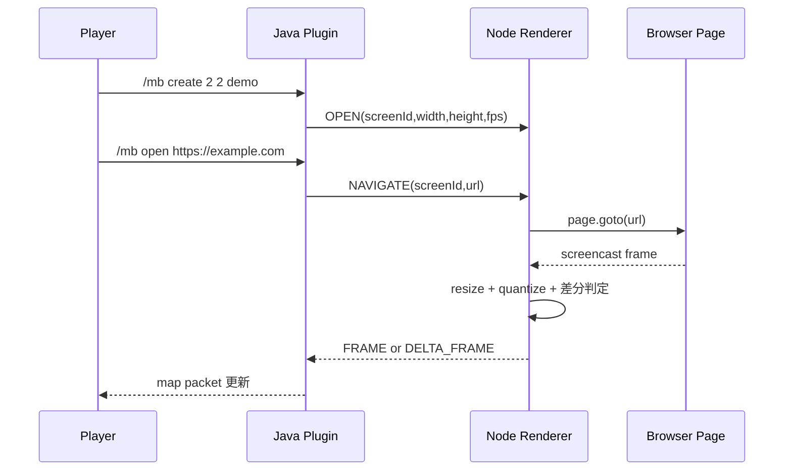
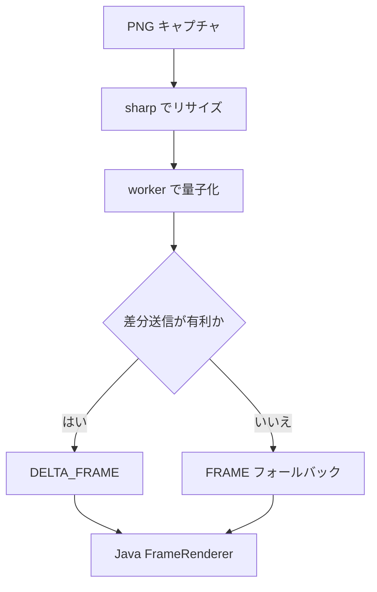

# アーキテクチャ (ja-jp)

## 全体トポロジ

## コンポーネント一覧

| サイド | コンポーネント | 役割 |
|---|---|---|
| Java | ScreenManager | スクリーンのライフサイクルと選択状態 |
| Java | FrameRenderer | FRAME/DELTA_FRAME の適用 |
| Java | BrowserIPCClient | 子プロセス起動、WS 接続、IPC ルーティング |
| Java | InputHandler | プレイヤー操作をブラウザ操作へ変換 |
| Java | DataStore | YAML/SQLite 永続化 |
| Node | IPCServer | Java メッセージ受信とイベント送信 |
| Node | BrowserPool | screenId とページ制御の対応管理 |
| Node | PageController | Playwright 制御とキャプチャ |
| Node | FrameProcessor | リサイズ・量子化・差分/全体判定 |
| Node | quantize.worker | Worker スレッドで量子化 |

## 通信ワークフロー

## IPC メッセージ群

| 方向 | メッセージ | 目的 |
|---|---|---|
| Java -> Node | OPEN, NAVIGATE, MOUSE_CLICK, SCROLL, GO_BACK, GO_FORWARD, RELOAD, CLOSE, SET_FPS | ブラウザ制御とスクリーン管理 |
| Node -> Java | READY, FRAME, DELTA_FRAME, URL_CHANGED, PAGE_LOADED, AUDIO_FRAME, ERROR | 描画イベントと状態通知 |

## フレーム処理

1. Playwright で画面をキャプチャ
2. sharp でマップ解像度へリサイズ
3. worker で量子化
4. 差分矩形を算出
5. 差分が大きければ FRAME にフォールバック
6. Java 側へ FRAME または DELTA_FRAME を送信

## 永続化

| バックエンド | 用途 | 備考 |
|---|---|---|
| yaml | 小規模運用 | 手動確認しやすい |
| sqlite | 本番寄り運用 | データ整合性と運用性が高い |

## 補助ブリッジ

| ブリッジ | チャンネル | 現在のコマンド |
|---|---|---|
| 音声 | mapbrowser:audio | エンコード済みフレーム転送 |
| Velocity | mapbrowser:velocity | PING/STATUS, OPEN_URL, RELOAD_SCREEN, SET_FPS, CLOSE_SCREEN, BACK_SCREEN, FORWARD_SCREEN |

Velocity `STATUS` の現在の返却項目:

- screenCount
- ipcConnected
- onlinePlayers
- ipcHealthSummary
- inboundTotal
- inboundFrame
- inboundDelta
- audioDiagnostics
