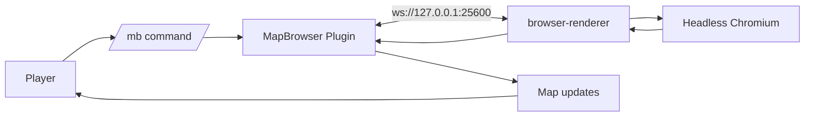
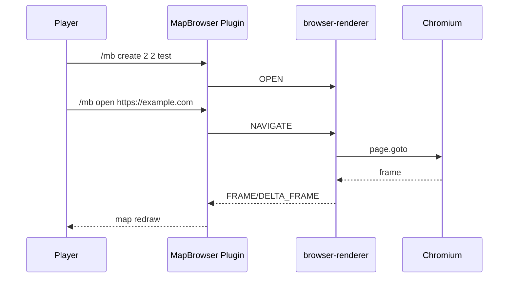

# ゲーム内利用ガイド (ja-jp)

このページは、MapBrowser を「実際にゲーム内で使う」ための手順を最初から最後までまとめた運用ガイドです。

## 対象

- サーバー管理者
- 実際に操作するプレイヤー
- 動作確認を行うテスター

## 先に知っておくこと

MapBrowser は次の 2 プロセスで動作します。

- Java プラグイン
- browser-renderer (Node.js)

そのため、サーバー起動時に Java 側だけ有効でも renderer が失敗していると映像は表示されません。

## クイックスタート (最短)

1. サーバーを起動する
2. ゲームに参加する
3. 対象ブロックを見ながら `/mb create 2 2 test`
4. `/mb open https://example.com`
5. 画面更新を確認する

## 操作の流れ

## ディスプレイの設置方法

### 現在実装の仕様

- `/mb create <w> <h> [name]` でスクリーンを作成
- 作成時の向きは現在実装では固定で `NORTH`
- プレイヤーが見ているブロック位置を基準にスクリーンが生成される
- 作成直後、そのスクリーンが自動で選択状態になる

### 設置のおすすめ手順

1. 画面を置きたい壁面のブロックを正面から見る
2. `/mb create 2 2 lobby`
3. `/mb info` でサイズと状態を確認
4. `/mb open https://example.com` で描画確認

### サイズの考え方

| サイズ | 用途 | 負荷の目安 |
|---|---|---|
| 1x1 | テスト・小型表示 | 低 |
| 2x2 | 標準利用 | 中 |
| 4x4 | 大型表示 | 高 |
| 8x8 | 上限サイズ | 非常に高 |

## 全コマンド解説

ベースコマンド:

- `/mapbrowser`
- `/mb`

### 1) 画面作成・管理

| コマンド | 例 | 説明 | 備考 |
|---|---|---|---|
| `/mb create <w> <h> [name]` | `/mb create 2 2 test` | スクリーンを作成 | 実行者がプレイヤーである必要あり |
| `/mb list` | `/mb list` | スクリーン一覧を表示 | ID の確認に使う |
| `/mb info` | `/mb info` | 現在選択中スクリーンの詳細 | URL, 状態, サイズを確認 |
| `/mb destroy` | `/mb destroy` | 現在選択中スクリーンを削除 | 削除時にブラウザも CLOSE |

### 2) ブラウザ操作

| コマンド | 例 | 説明 | 備考 |
|---|---|---|---|
| `/mb open <url>` | `/mb open https://example.com` | URL を開く | セキュリティ設定で拒否される場合あり |
| `/mb back` | `/mb back` | 戻る | 選択中スクリーンが必要 |
| `/mb forward` | `/mb forward` | 進む | 選択中スクリーンが必要 |
| `/mb reload` | `/mb reload` | リロード | 選択中スクリーンが必要 |
| `/mb fps <value>` | `/mb fps 10` | FPS を変更 | 1〜max-fps の範囲 |
| `/mb exit` | `/mb exit` | 操作モード終了 | 選択状態を解除 |

### 3) 操作用アイテム

| コマンド | 例 | 説明 |
|---|---|---|
| `/mb give <item>` | `/mb give pointer` | 操作アイテムを付与 |

有効な item:

- `pointer`
- `back`
- `forward`
- `reload`
- `url-bar`
- `scroll-up`
- `scroll-down`

### 4) 管理コマンド

| コマンド | 例 | 説明 |
|---|---|---|
| `/mb admin status` | `/mb admin status` | IPC 接続状態とスクリーン数を確認 |
| `/mb admin stop <screenId>` | `/mb admin stop 00000000-0000-0000-0000-000000000000` | 指定スクリーンのブラウザを停止 |

## アイテム操作ガイド

現在のデフォルト割り当ては次のとおりです。

| 操作 | アイテム |
|---|---|
| pointer | FEATHER |
| back | BOW |
| forward | ARROW |
| reload | COMPASS |
| url-bar | BOOK_AND_QUILL |
| scroll-up | SLIME_BALL |
| scroll-down | MAGMA_CREAM |

### 使い方

1. `/mb give pointer` などでアイテムを受け取る
2. 対象スクリーンを作成済みの状態にする
3. アイテムをメインハンドに持って右クリックする

## ブラウザ操作の実挙動 (現実装)

現時点の挙動は次のとおりです。

- pointer クリックは現在「画面中央への左クリック」
- back, forward, reload, scroll は対応済み
- url-bar は Anvil UI で URL 入力
- URL は security 設定でバリデーション

## 典型的な利用シナリオ

### ロビー案内スクリーン

1. `/mb create 2 2 lobby`
2. `/mb open https://example.com/news`
3. `/mb fps 5` で負荷を抑える

### 管理者監視スクリーン

1. `/mb create 1 1 monitor`
2. `/mb open https://status.example.com`
3. `/mb reload` を必要時に実行

## よくある質問

### Q1. `/mb open` が拒否される

- `allow-http: false` で http URL を使っていないか
- `block-local-network: true` でローカルIPを開いていないか
- whitelist/blacklist の条件に合っているか

### Q2. コマンドは通るが画面が更新されない

- `/mb admin status` で `IPC connected` を確認
- renderer の `dist` と Chromium インストールを確認
- `config.yml` の `renderer-dir` を確認

### Q3. スクリーンを作ったのに操作できない

- 実行者がプレイヤーか
- 権限 `mapbrowser.use` が付与されているか
- `/mb exit` 済みで選択解除されていないか

## 運用時の推奨設定

- 初期検証は 1x1 or 2x2
- FPS は 10 から開始
- 公開サーバーでは URL 制限を有効化
- `renderer-dir` は絶対パス運用

## 関連ドキュメント

- [インストール](installation.md)
- [設定リファレンス](configuration.md)
- [コマンド一覧](commands.md)
- [トラブルシュート](troubleshooting.md)
